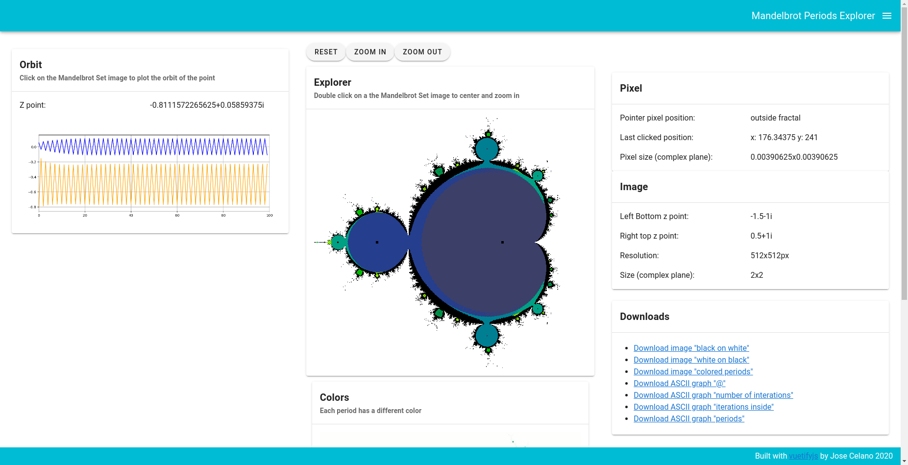

[](https://travis-ci.com/github/josecelano/mandelbrot-explorer)

# Mandelbrot Explorer

This web application shows the orbit of a given point in the Mandelbrot Set fractal.
The main reason why this project was built is to understand the "Period Cheking" performance techniche.

In order to generate the Mandelbrot Set fractal you need to calculate recursively the formula `f(z) = z² + c`, where `z` and `c` are complex numbers.
The series of values is the [orbit of the point](https://en.wikipedia.org/wiki/Orbit_trap). Points inside the Mandelbrot Set do not diverge.

"Period Cheking" is based in a fractal property, some point orbits inside the Mandelbrot Set has a cycle with different period. For example, all point inside the main cardioid tends to a fix value, points in the main circle (on the left of the main cardioid) have a cycle of period 2.

When you detect a cycle in a orbit you can stop the calculation of the point and save some loop iterations. THat techiche is used by fractal generation softwware like [Gnofract 4D](https://github.com/fract4d/gnofract4d).

If you want to know more you can read this [period checking](https://github.com/josecelano/c-mandelbrot-arbitrary-precision/blob/master/doc/periodicity-checking.md) documentation.

Online demo: https://mandelbrot-set-periods.online



## Usage

If you just want to play a litle bit in your local machine the fastest way is simply executing:
```
docker run --rm -p80:80 josecelano/mandelbrot-explorer
```
And open http://localhost in your browser.

Or you can use de online demo: https://mandelbrot-set-periods.online

Or you can install the project locally (see development section).

## Development

Requirements:

* Docker: 19.03.6
* Docker Compose: 1.24.1

Compiles and hot-reloads for development:
```
./bin/dev/serve
```

Execute tests:
```
./bin/dev/test
```

Execute linter:
```
./bin/dev/lint
```

## Production

Compiles and minifies for production:
```
./bin/production/build
```

Test production artifact in localhost:
```
./bin/production/serve
```

## Deploy

The demo environment was deployed to [Digital Ocean Kubernetes](https://www.digitalocean.com/community/tutorials/how-to-set-up-an-nginx-ingress-on-digitalocean-kubernetes-using-helm).

You can see the `yaml` files in [deploy/k8s](deploy/k8s) folder.

Init cluster:
```shell
helm install nginx-ingress stable/nginx-ingress --set controller.publishService.enabled=true
kubectl apply --validate=false -f https://github.com/jetstack/cert-manager/releases/download/v0.14.1/cert-manager.crds.yaml
kubectl create namespace cert-manager
helm repo add jetstack https://charts.jetstack.io
helm install cert-manager --version v0.14.1 --namespace cert-manager jetstack/cert-manager
kubectl create -f ./deploy/k8s/production-issuer.yaml
```

Deploy app the first time:
```shell
kubectl create -f ./deploy/k8s/mandelbrot-explorer.yaml
kubectl create -f ./deploy/k8s/mandelbrot-explorer-ingress.yaml
```

Re-deploy app after changing docker image:
```
kubectl rollout restart deployment mandelbrot-explorer
`` 

After executing `create` commands you should see something like:

```
$ kubectl get ingress
NAME                          CLASS    HOSTS                           ADDRESS           PORTS     AGE
mandelbrot-api-ingress        <none>   mandelbrot-set-periods.online   165.227.246.133   80, 443   12d
mandelbrot-explorer-ingress   <none>   mandelbrot-set-periods.online   165.227.246.133   80, 443   18m

$ kubectl get service
NAME                            TYPE           CLUSTER-IP       EXTERNAL-IP       PORT(S)                      AGE
kubernetes                      ClusterIP      10.245.0.1       <none>            443/TCP                      14d
mandelbrot-api                  ClusterIP      10.245.177.151   <none>            80/TCP                       12d
mandelbrot-explorer             ClusterIP      10.245.125.100   <none>            80/TCP                       19m
nginx-ingress-controller        LoadBalancer   10.245.180.171   165.227.246.133   80:30719/TCP,443:32694/TCP   12d
nginx-ingress-default-backend   ClusterIP      10.245.90.167    <none>            80/TCP                       12d

$ kubectl get deployment
NAME                            READY   UP-TO-DATE   AVAILABLE   AGE
mandelbrot-api                  3/3     3            3           12d
mandelbrot-explorer             3/3     3            3           19m
nginx-ingress-controller        1/1     1            1           12d
nginx-ingress-default-backend   1/1     1            1           12d

$ kubectl get pod
NAME                                             READY   STATUS    RESTARTS   AGE
mandelbrot-api-7b89465576-8fbjc                  1/1     Running   0          10d
mandelbrot-api-7b89465576-gfnrv                  1/1     Running   0          10d
mandelbrot-api-7b89465576-qs62p                  1/1     Running   0          10d
mandelbrot-explorer-8c458947c-g2ms7              1/1     Running   0          20m
mandelbrot-explorer-8c458947c-j2pp5              1/1     Running   0          20m
mandelbrot-explorer-8c458947c-z9h4s              1/1     Running   0          20m
nginx-ingress-controller-78c67bcc77-vcp9m        1/1     Running   1          10d
nginx-ingress-default-backend-7c868597f4-wqd2z   1/1     Running   1          10d
```

## Related projects

This API uses these two command line applications:
* [Console command to generate tiles](https://github.com/josecelano/c-mandelbrot-arbitrary-precision)
* [Console command to generate orbits](https://github.com/josecelano/mandelbrot-orbit)
* [API wrapper for console commands (tiles and orbits)](https://github.com/josecelano/mandelbrot-api)

## Links

* [Orbit traps](https://www.fractaldomains.com/tutorial/use-orbit-traps/2/)
* [Orbit visualization](http://www.stefanbion.de/fraktal-generator/z-orbits.htm)
* [Orbit periods](https://plus.maths.org/content/unveiling-mandelbrot-set) 
